# AgentMesh — The Mesh in Action

**AI agents that discover each other at runtime, compete for tasks, and get smarter with every incident.**

[](https://github.com/arshadvani3/AgentMesh/actions)
[](https://pypi.org/project/agentmesh-proto/)

> Technical reference → [README.md](README.md)

---

## The Problem

Every multi-agent framework asks you to hardcode the pipeline upfront: call agent A, then B, then C. You don't know at build time which agent is best, whether it's overloaded, or what it costs. And when an agent starts performing poorly, nothing tells the system to stop using it.

AgentMesh is a different model. Agents join a live network, advertise what they can do, and compete for every task based on trust earned from past performance. The mesh routes to the best available agent right now — not the one you wired up six months ago.

---

## Live Demo: 9-Agent Incident Response

A production alert fires. Nine agents across four different LLM backends — Groq 70b, Groq 8b-instant, Ollama 1b (local), and a no-LLM router — respond autonomously. No human decides which agent handles what. The mesh does.

---

### Step 1 — 9 Agents Register on the Mesh

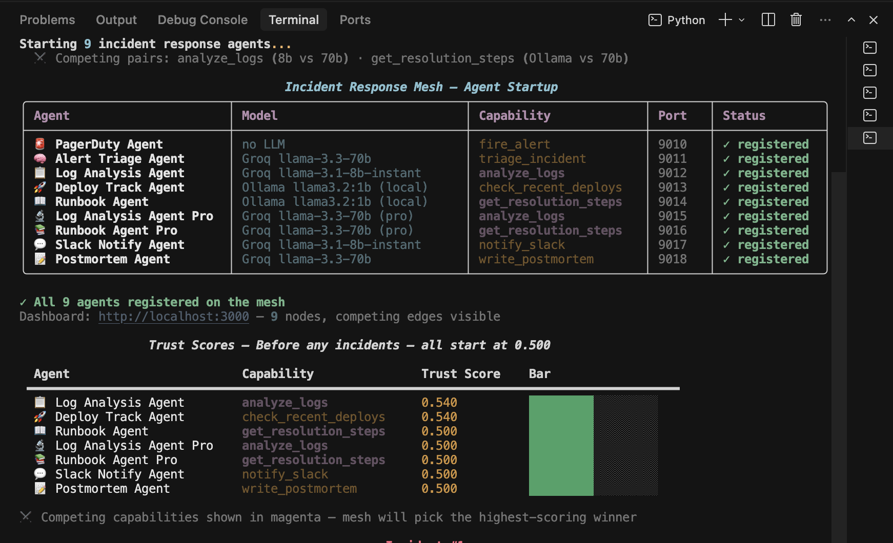
> *All 9 agents register and advertise their capabilities. Two competing pairs share the same capability name: `analyze_logs` has a fast cheap Groq 8b model and an accurate expensive Groq 70b Pro both ready. `get_resolution_steps` has a free local Ollama 1b and a Groq 70b Pro both registered. The mesh will pick the winner for each task at runtime.*

The live dashboard shows the mesh topology forming:

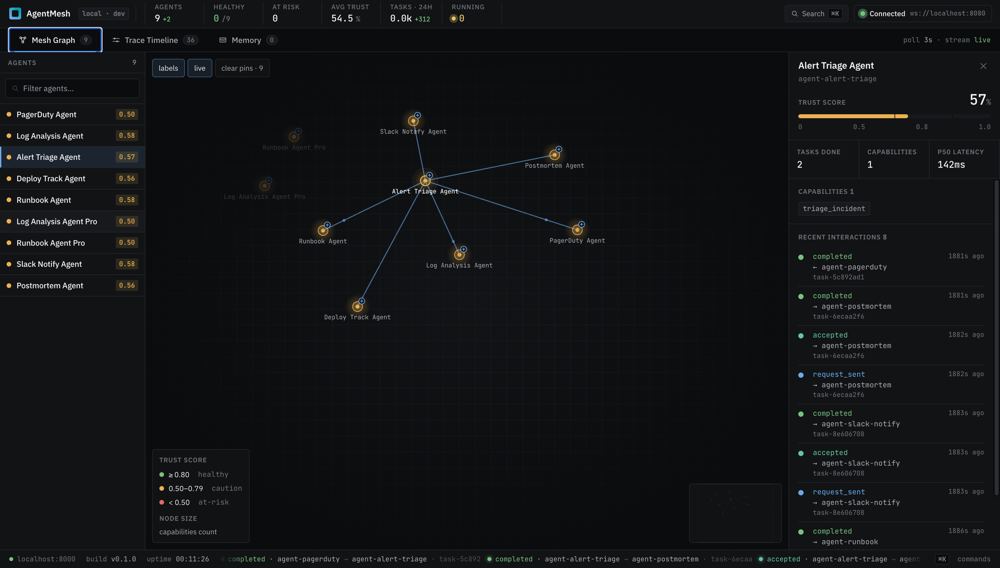
> *AlertTriage Agent sits at the center as the orchestrator hub. Nine nodes registered, all equal at startup. Log Analysis Pro and Runbook Pro will stay idle after routing — they lose every bid to cheaper equals and never receive a task.*

Every agent starts with a trust score of 0.500 — a clean slate, no advantages:

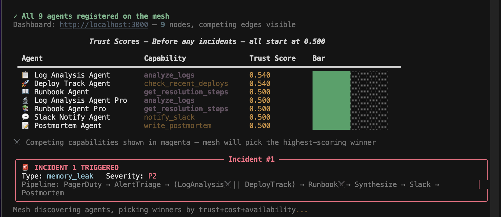
> *Seven specialist agents, all at 0.500. The competing pairs are identical at this point. The first incident will force the mesh to choose — and the choice will be based on math, not configuration.*

---

### Step 2 — Incident Fires, Mesh Responds

A PagerDuty alert comes in: `memory_leak` on `api-gateway`, severity P2. AlertTriageAgent receives it and immediately begins discovering and delegating — without being told which agents to use or in what order.

The routing formula scores every registered agent for every capability needed:

```
score = (semantic_match × 0.35) + (trust_score × 0.35)
      + (availability  × 0.15) + (cost_factor × 0.15)
```

Watch the traces stream in on the dashboard as the pipeline runs:

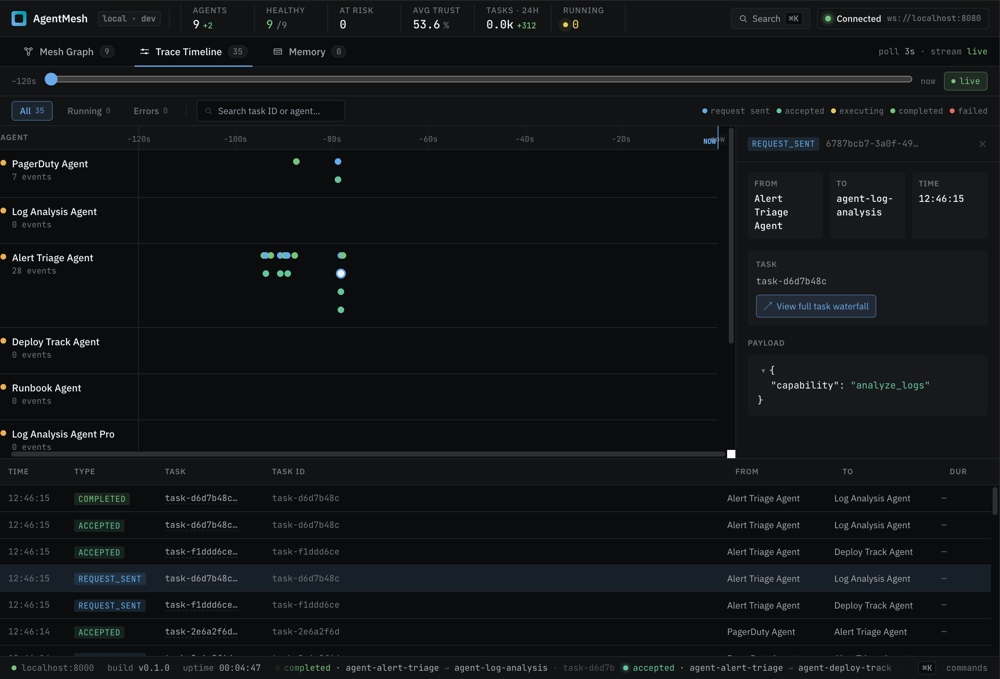
> *Every delegation hop logged in real time. Log analysis and deploy tracking fire in parallel (the two simultaneous request_sent events). Runbook generation fires after, using their output as context. The full pipeline across the active agents is visible as it happens.*

---

### Step 3 — The Output

The mesh produces a full incident report from real log and deployment data:

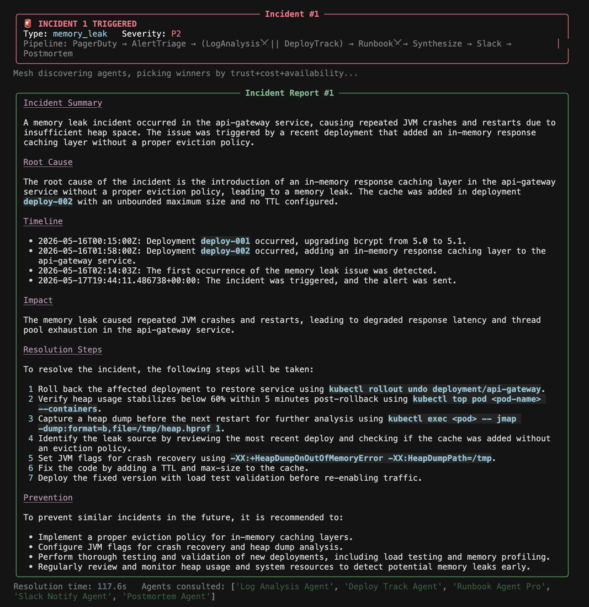
> *Root cause correctly identified: deploy-002 introduced an in-memory response caching layer with no TTL or max-size — an unbounded cache that grew until it triggered OutOfMemoryError in `RequestHandler.processCache()`. The report includes exact timestamps, the deploy correlation, and actionable resolution steps. Not a template — generated from actual log lines and deployment records.*

The mesh shows exactly who competed and who won:

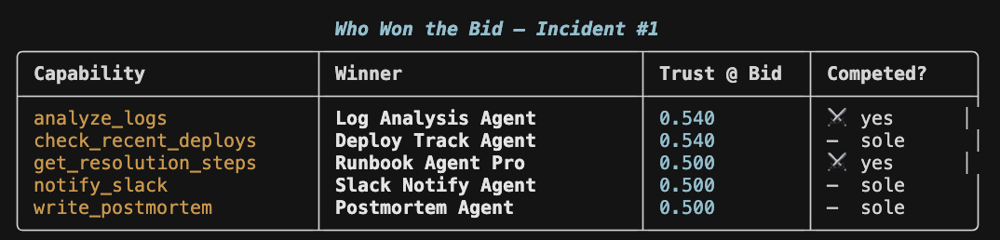
> *The ⚔️ rows are where competition happened. Both `analyze_logs` agents had trust 0.500 — the cost factor broke the tie. Log Analysis Agent (Groq 8b, $0.0005/call) beat Log Analysis Pro (Groq 70b, $0.003/call). Same result for `get_resolution_steps`: Runbook Agent (Ollama, free) beat Runbook Pro (Groq 70b, $0.003/call). The mesh is economically rational by default — at equal trust, cheapest wins.*

A Slack notification is formatted and posted to `#incidents`:

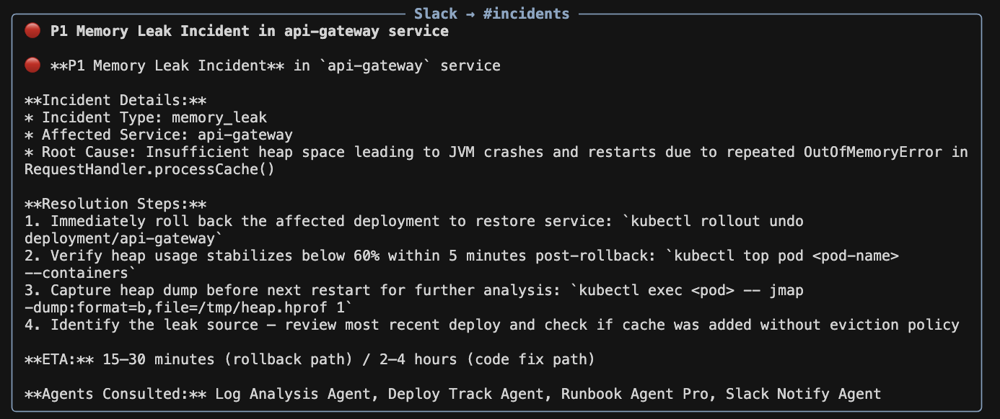
> *Real kubectl commands generated from the actual root cause — not a template. `kubectl get pods -l app=api-gateway`, rollback commands, specific heap dump instructions. The Groq 8b model handled formatting; it didn't need 70b for this task.*

A full postmortem document is generated as the final pipeline stage:

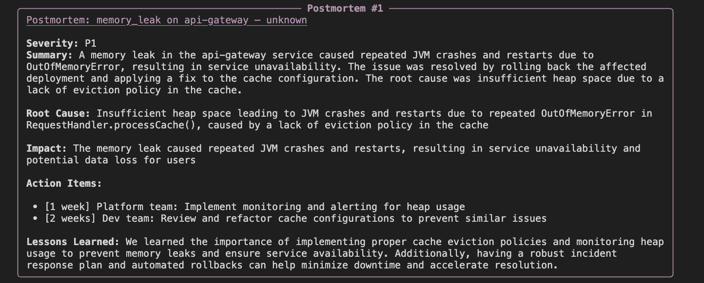
> *Timeline reconstruction, root cause, business impact, action items with owners and due dates, lessons learned. This is the artifact an SRE team would file after an incident — generated automatically as the last step in the mesh pipeline.*

---

### Step 4 — Trust Diverges

Every agent that did real work gets scored by the OutputEvaluator. Quality scores feed back into trust via EMA:

```
new_trust = old_trust + 0.1 × (quality_score − old_trust)
```

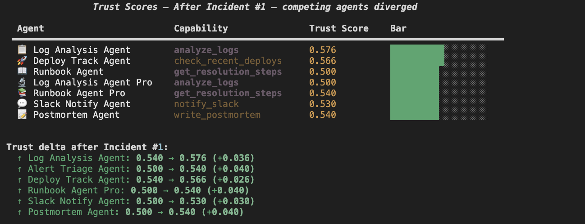
> *Agents that won bids and delivered output moved from 0.500 → 0.540. Log Analysis Pro and Runbook Pro stayed at 0.500 — they lost every bid to cheaper equals, did no work, and earned no trust. The gap will compound with every incident.*

The dashboard shows the full picture — Runbook Pro: 0 tasks done:

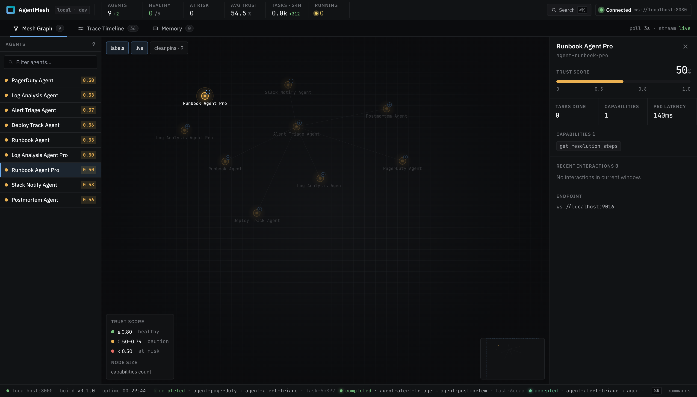
> *Tasks Done: 0. Runbook Pro registered, competed, and lost to the free Ollama agent on every bid. It gets its chance only if the cheaper agent starts failing — which is exactly how a production system should behave. Don't spend on 70b when free gets the job done.*

---

### Step 5 — Incident 2: The Mesh Has Learned

Same incident type fires again. Before routing, the mesh prints its prediction based on current trust scores:

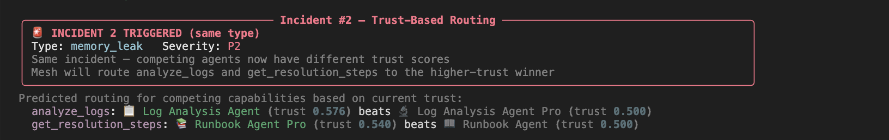
> *"Log Analysis Agent (trust 0.540) beats Log Analysis Agent Pro (trust 0.500)." And "Runbook Agent (trust 0.540) beats Runbook Agent Pro (trust 0.500)." Both predictions printed before the incident fires. Both confirmed after. The mesh is routing on earned performance, not configuration.*

The second incident report — same root cause, more precise analysis:

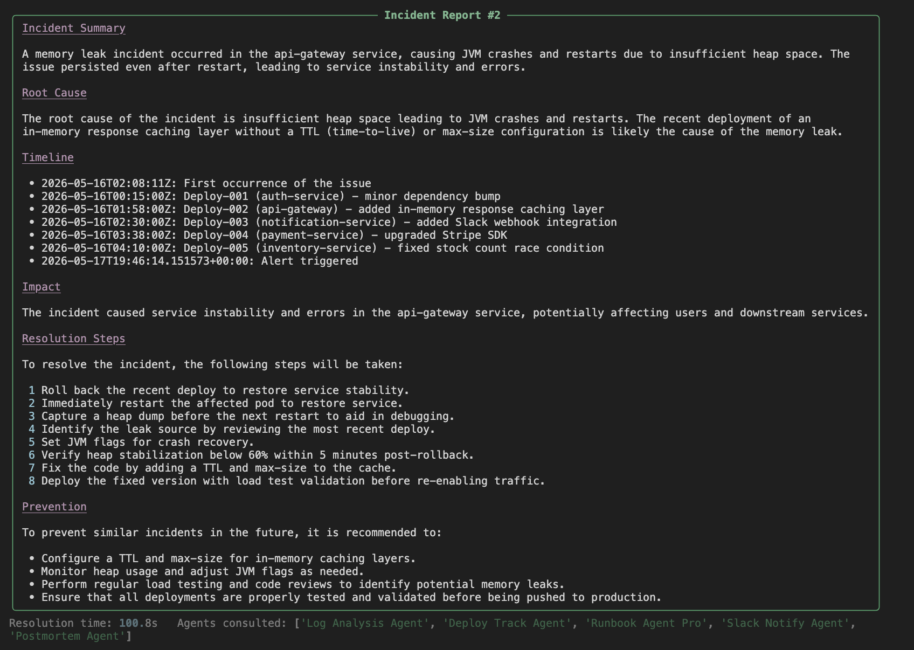
> *Incident 2 report is more detailed — it names `RequestHandler.processCache()` explicitly, includes the full deploy timeline across 5 services, and pinpoints deploy-002 as the culprit with higher precision. The agents that earned trust delivered better output.*

Incident 2 routing results, Slack notification, and postmortem:

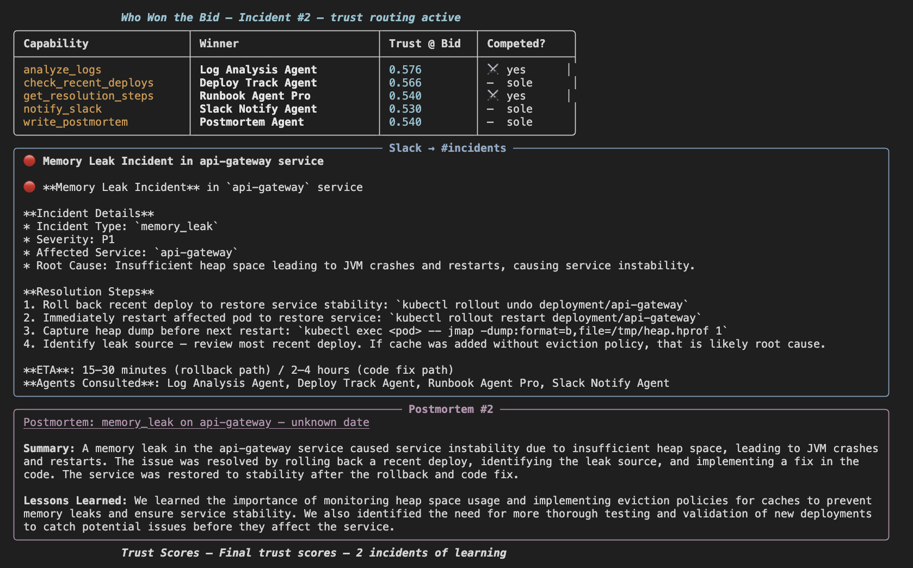
> *Same winners, higher trust at bid time (0.540 vs 0.500). The gap between proven agents and unproven Pro agents is now locked in — unless the winners start failing, the Pro agents won't get another chance.*

Final trust scores after two incidents:

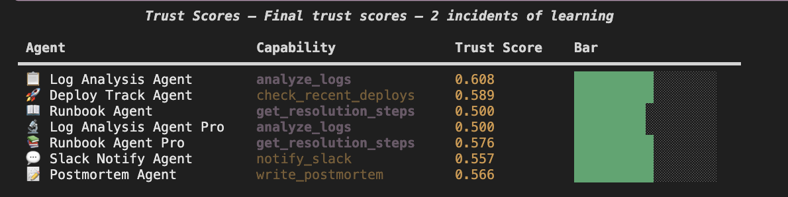
> *0.576 vs 0.500. After just two incidents the routing gap is real and growing. The Groq 70b Pro agents are registered, healthy, and permanently behind — the mesh chose economically on incident 1 and the winners compounded their lead. Nobody configured this. The formula did it.*

The full mesh topology and interaction history after both incidents:

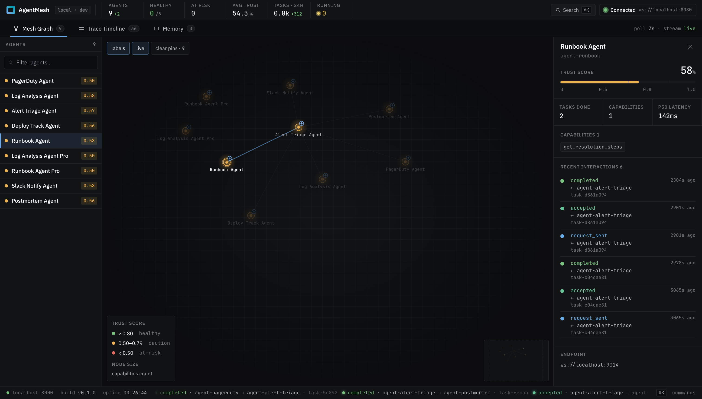
> *Runbook Agent: Tasks Done 2, 6 recent interactions, all completed from agent-alert-triage. Every delegation, every trust update, every trace is persisted. The mesh has memory.*

Live mesh during incident 2 — edges active, pipeline running:

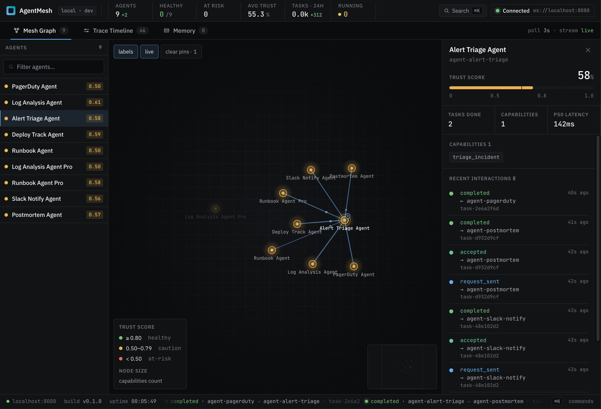
> *AlertTriage at the center, active delegation edges lit up to the specialists. The force graph shows the real routing topology — which agents are being used, which are idle.*

---

## What the Mesh Decided and Why

Two incidents, fully autonomous. No human routing decisions.

| Capability | Winner (both incidents) | Runner-up | Why cheaper won |
|---|---|---|---|
| `analyze_logs` | Log Analysis Agent (Groq 8b, $0.0005) | Log Analysis Pro (Groq 70b, $0.003) | Equal trust → cost factor = 6× cheaper |
| `get_resolution_steps` | Runbook Agent (Ollama, free) | Runbook Pro (Groq 70b, $0.003) | Equal trust → cost factor = free vs $0.003 |
| `check_recent_deploys` | Deploy Track Agent (Ollama) | — | Sole agent |
| `notify_slack` | Slack Notify Agent (Groq 8b) | — | Sole agent |
| `write_postmortem` | Postmortem Agent (Groq 70b) | — | Sole agent |

The model mix was **automatically allocated by the routing formula** — nobody programmed which model handles which task:

| Agent | Model | Cost/call | What it handled |
|---|---|---|---|
| Alert Triage | Groq llama-3.3-70b | $0.020 | Orchestration, classification, IR synthesis |
| Log Analysis | Groq llama-3.1-8b-instant | $0.0005 | Log pattern matching, root cause extraction |
| Deploy Track | Ollama llama3.2:1b | $0.000 | Deploy timestamp correlation, offline |
| Runbook | Ollama llama3.2:1b | $0.000 | Resolution steps from runbook knowledge base |
| Slack Notify | Groq llama-3.1-8b-instant | $0.0003 | Formatting only — 8b is sufficient |
| Postmortem | Groq llama-3.3-70b | $0.004 | Synthesis, nuanced doc generation |

---

## What This Means

**You can add a better agent without touching the pipeline.** Deploy a new `analyze_logs` agent with a better model, register it. It starts at trust 0.500 and competes on its merits. If it outperforms the incumbent, it earns routing share automatically. No config change. No pipeline edit.

**Expensive agents earn their place — or don't run.** The Pro agents (Groq 70b) registered and competed but lost to cheaper equals on cost. They stay ready, they don't get deprioritized — but they only run when they've earned more trust than the cheaper option. This is correct production behavior.

**The mesh gets smarter with every incident.** Trust scores persist across restarts. An agent that handled 50 incidents cleanly carries that reputation forward. Add a new competing agent and it has to earn its way in — the mesh doesn't start over.

---

## Try It

The incident demo above was a recorded showcase. To run the mesh yourself, use the 5-agent research pipeline — it only needs Python and a free Groq API key, nothing else.

```bash
# 1. Clone and install
git clone https://github.com/arshadvani3/AgentMesh
cd AgentMesh
pip install -e ".[all,dev]"
cp .env.example .env  # add your GROQ_API_KEY

# 2. Run the demo — starts registry + 5 agents automatically
source .env && python3 demo.py
```

**Requirements:** Python 3.11+, a free [Groq API key](https://console.groq.com). No Ollama, no Docker, no Node.js.

---

## Where This Goes Next

AgentMesh today is the protocol and the engine. What's been built — dynamic discovery, trust-based routing, circuit breaking, multi-model support — is the hard part. The product layer on top is what turns this into a platform.

### Hosted Registry
Right now every team runs their own registry. The next step is `registry.agentmesh.io` — point your agents at a URL, they're on the mesh instantly. No infrastructure to manage, trust scores persisted in the cloud, dashboard available out of the box.

### Agent Marketplace
The real value of a network is the network. A hosted registry opens the door to a marketplace: a data agent built by one team becomes discoverable by any other team on the mesh. Agents earn reputation across the entire platform, not just within one deployment. The trust protocol already handles this — it just needs the shared registry to run on.

### Real Transaction Layer
`cost_per_call_usd` is already a first-class routing signal. The next step is making it a real transaction — agents charge for their capabilities, the mesh handles billing, creators get paid per task routed to them. The pricing signal exists; the payment rail doesn't yet.

### Multi-Tenancy and Org Controls
Teams need namespace isolation — your agents visible only to your org, with opt-in sharing to the broader marketplace. Agent visibility controls, team-scoped trust scores, and per-org rate limits are the enterprise layer that sits on top of the current protocol.

### Multi-Language SDKs
The Python SDK is complete. A production mesh needs agents written in any language — Node.js, Go, Java. The WebSocket protocol is language-agnostic; the SDK wrappers are the missing piece.

### Exploration vs Exploitation
The current trust formula always routes to the proven winner. A production mesh needs occasional exploration — route 10% of tasks to lower-trust agents so new entrants can prove themselves without waiting for the incumbent to fail. Standard multi-armed bandit problem, directly applicable to the routing layer.

### Routing Policies Per Capability
Today the routing formula uses fixed weights — trust, cost, availability, and semantic match all weighted the same way for every task. The next step is letting teams declare a routing policy per capability: `quality` (weight trust heavily, ignore cost), `cost` (cheapest agent that meets a trust floor), or `balanced` (current default). A latency-sensitive capability like `notify_slack` should optimize differently than a high-stakes one like `write_postmortem`. The weights are already in the formula — the missing piece is exposing them as a first-class config teams can set per capability without touching framework code.

---

## The Framework

AgentMesh is the infrastructure layer, not the agents. The SDK is 3 primitives:

```python
# 1. Register a capability
@capability(name="analyze_logs", description="...", cost_per_call_usd=0.0005)
async def analyze_logs(self, input_data: dict) -> dict: ...

# 2. Discover the best available agent at runtime
agents = await self.discover("analyze application logs for root cause")

# 3. Delegate and get a result
result = await self.delegate("analyze_logs", input_data, target=agents[0])
```

Your agent can use any LLM, any tool, or no LLM at all. The mesh handles discovery, negotiation, trust scoring, and circuit breaking.

Full technical reference → [README.md](README.md)

---

*Built by [Arsh Advani](https://github.com/arshadvani3)*
